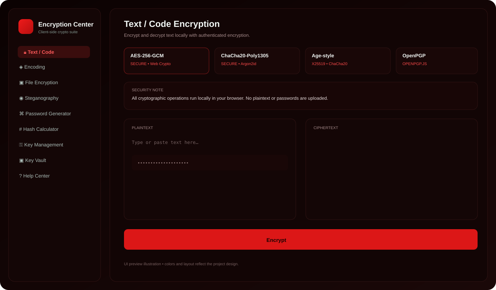
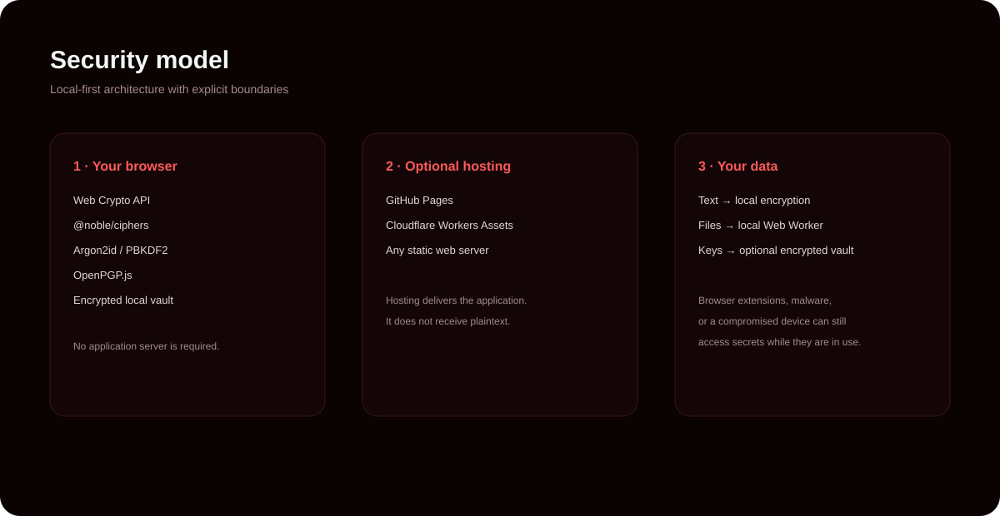

# Encryption Center — Español

<p align="center"></p>




Suite de criptografía **local-first** y de código abierto para navegador y escritorio.

Incluye AES-256-GCM, ChaCha20-Poly1305, PBKDF2, Argon2id, cifrado de archivos y carpetas, hashes SHA/SHA-3/BLAKE, HMAC, firmas Ed25519, gestión y bóveda de claves, esteganografía, inspector ECV2, comprobación de seguridad, PWA, GitHub Pages, Cloudflare Workers, Electron/EXE y CLI.

**Idiomas:** [English](README.md) · [فارسی](README.fa.md) · [Español](README.es.md) · [Türkçe](README.tr.md)

## Capturas




## Instalación local

Requiere Node.js 22+ y npm 10+.

```bash
git clone https://github.com/shayradghoraishi/encryption-center.git
cd encryption-center
npm ci
npm run dev
```

Comprobación y build:

```bash
npm run check
npm run build
```

## GitHub Pages

El proyecto usa `HashRouter` y rutas relativas, por lo que funciona como GitHub Pages de proyecto. Activa **Settings → Pages → GitHub Actions**.

## Cloudflare Workers

```bash
npm run cf:preview
npm run cf:deploy
```

## EXE

```bash
npm run build
npm run desktop:install
npm run desktop:build
```

## CLI

```bash
node cli/encryption-center.mjs encrypt archivo.pdf archivo.pdf.enc
node cli/encryption-center.mjs decrypt archivo.pdf.enc archivo.pdf
node cli/encryption-center.mjs hash archivo.pdf sha256
node cli/encryption-center.mjs inspect archivo.pdf.enc
```

Consulta el [README completo en inglés](README.md) para el modelo de seguridad, formato ECV2, estructura del proyecto y guía de publicación.

## Licencia

MIT — consulta [LICENSE](LICENSE).
