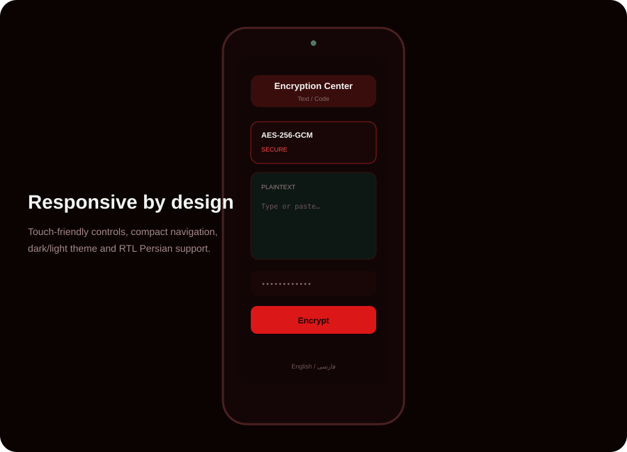

# Encryption Center

<p align="center"></p>


**A local-first, open-source cryptography toolkit for the web and desktop.**

Encryption Center brings authenticated encryption, file/folder protection, hashing, digital signatures, key management, steganography, encoding, password generation, inspection and security diagnostics into one clean interface.

> **Security philosophy:** sensitive operations are designed to happen locally. Encryption Center does not need a server to encrypt your data. The project deliberately avoids promising impossible things such as “unbreakable encryption” or guaranteed memory wiping.

[](LICENSE)
[](https://pages.github.com/)
[](https://workers.cloudflare.com/)
[](https://web.dev/progressive-web-apps/)

**Languages:** [English](README.md) · [فارسی](README.fa.md) · [Español](README.es.md) · [Türkçe](README.tr.md)

---

## ✨ What it includes

### Modern cryptography

- AES-256-GCM
- ChaCha20-Poly1305
- X25519-based age-style encryption flow (custom format; **not** official age compatibility)
- RSA-OAEP key generation
- Ed25519 signing and verification
- ECDSA key generation
- PBKDF2 and Argon2id password-based key derivation
- Authenticated cascade encryption
- Versioned ECV2 encrypted file format

### Files and folders

- Multi-file batch encryption/decryption
- 1 MiB chunked AES-256-GCM file encryption in a Web Worker
- Per-chunk authentication and chunk-position binding
- Folder packing with the ECF1 container
- Folder encryption/decryption
- Relative path preservation
- Progress reporting
- Corruption/truncation detection

> ECF1 is an Encryption Center container, not a ZIP archive. The packed container is protected by ECV2 authenticated encryption.

### Integrity and authenticity

- SHA-1, SHA-256, SHA-384, SHA-512
- SHA-3-256 and SHA-3-512
- BLAKE2b-512
- BLAKE3-256
- HMAC for SHA-1/SHA-2 text input
- File hashing
- Digest comparison
- Ed25519 text signatures
- Ed25519 file signatures
- Signature verification

### Key tools

- RSA-2048/3072/4096
- ECDSA P-256/P-384/P-521
- Ed25519
- OpenPGP key generation
- Local encrypted Key Vault
- QR display for public keys
- Encrypted session backup

### Utilities

- Cryptographically random password generator
- Passphrase generator
- Password entropy/strength estimate
- Encoding tools
- Classical ciphers for education
- Image/text steganography
- ECV2 File Inspector
- Browser Security Check
- Privacy Dashboard
- Local operation history
- English / فارسی interface with RTL support
- Responsive mobile UI
- PWA/offline caching
- Optional Electron desktop build
- CLI for ECV2 encryption, decryption, hashing and inspection

---

## 🖼️ Screenshots

### Desktop


### Security tools


### Mobile



---

## 🔐 Security model

Encryption Center is designed as a **client-side/local-first** application:

1. Plaintext is processed by the browser or desktop runtime.
2. Password-based keys are derived locally.
3. Encryption/decryption happens locally.
4. The application does not require a backend for cryptographic operations.
5. Optional local history and the Key Vault use browser storage.

### ECV2 file format

The current encrypted file format is:

```text
ECV2 header
├── magic: 4 bytes
├── salt: 16 bytes
├── chunk size: 4 bytes LE
├── original size: 8 bytes LE
└── chunk count: 4 bytes LE

For every chunk:
├── nonce: 12 bytes
├── ciphertext length: 4 bytes LE
└── AES-256-GCM ciphertext + tag
```

Each chunk authenticates the complete header and its chunk index as additional authenticated data. This prevents an attacker from simply reordering authenticated chunks without detection.

### Important limitations

Encryption Center is software, not a security boundary around your entire computer. Your operating system, browser, extensions, backups, clipboard, screenshots, malware, physical access and user behavior can still matter.

Do not treat the project as a substitute for a professionally audited high-assurance cryptographic system.

---

## 🚀 Run locally

### Requirements

- Node.js **22+**
- npm **10+**
- A modern browser with Web Crypto support

### Install

```bash
git clone https://github.com/shayradghoraishi/encryption-center.git
cd encryption-center
npm ci
```

### Development server

```bash
npm run dev
```

Open the URL printed by Vite, normally `http://localhost:5173`.

### Production build

```bash
npm run check
npm run build
npm run preview
```

`npm run check` runs linting and the production build.

---

## 🌐 GitHub Pages

The project uses `HashRouter` and a relative Vite base path, so it works as a GitHub Pages project site without server-side route rewriting.

1. Push the repository to GitHub.
2. Use the **main** branch.
3. In GitHub, open **Settings → Pages**.
4. Set the source to **GitHub Actions**.
5. Push a commit or manually run the Pages workflow.

The workflow is located at:

```text
.github/workflows/deploy-pages.yml
```

No server-side cryptography is required.

---

## ☁️ Cloudflare Workers

The project includes `wrangler.jsonc` for static asset deployment.

Install and authenticate Wrangler if necessary, then:

```bash
npm run cf:preview
npm run cf:deploy
```

The Worker serves the built static application. Cryptographic operations remain client-side.

See [DEPLOY-CLOUDFLARE.md](DEPLOY-CLOUDFLARE.md) for the deployment checklist.

---

## 🖥️ Desktop / EXE

Encryption Center can be wrapped in Electron without moving cryptographic operations to a remote server.

Build the web application first:

```bash
npm run build
```

Install desktop dependencies:

```bash
npm run desktop:install
```

Run the desktop application:

```bash
npm run desktop:start
```

Build Windows installers and a portable executable:

```bash
npm run desktop:build
```

The Electron configuration produces an NSIS installer and a portable `.exe`.

---

## 💻 CLI

Node.js 22+ is required.

```bash
node cli/encryption-center.mjs help
```

Examples:

```bash
node cli/encryption-center.mjs encrypt secret.pdf secret.pdf.enc
node cli/encryption-center.mjs decrypt secret.pdf.enc secret.pdf
node cli/encryption-center.mjs hash secret.pdf sha256
node cli/encryption-center.mjs inspect secret.pdf.enc
```

The CLI uses the same ECV2 layout as the browser file worker for password-based file encryption/decryption.

---

## 🧭 Main sections

| Section | Purpose |
|---|---|
| Text / Code | Encrypt and decrypt text locally |
| File Encryption | Batch and folder encryption |
| Hash Calculator | Text/file hashes and digest comparison |
| Digital Signatures | Ed25519 sign/verify |
| Key Management | Generate encryption/signing keys |
| Key Vault | Store private keys in an encrypted local vault |
| File Inspector | Inspect ECV2 without decrypting |
| Security Check | Inspect browser/runtime capabilities |
| Privacy | Explain local storage and network behavior |
| Password Generator | Random passwords and passphrases |
| Steganography | Educational data hiding |
| Encoding | Non-confidential encodings |
| Classical Ciphers | Historical/educational ciphers |

---

## 🌍 Internationalization

The UI has a real localization layer rather than duplicated pages. Language preference is stored locally.

Currently included:

- English — `en`
- Persian — `fa` with automatic RTL

Additional language files can be added in `src/lib/i18n.jsx` without changing feature logic.

---

## 🧪 Testing and quality

Before publishing a release:

```bash
npm ci
npm run check
npm run build
```

Recommended manual checks:

- Encrypt and decrypt Unicode text.
- Encrypt/decrypt empty and multi-megabyte files.
- Encrypt/decrypt multiple files.
- Encrypt/decrypt a folder containing nested paths and Unicode filenames.
- Modify an ECV2 byte and confirm authentication failure.
- Truncate an ECV2 file and confirm rejection.
- Test wrong passwords.
- Generate and verify Ed25519 signatures.
- Compare file hashes against an independent implementation.
- Test GitHub Pages under a repository subpath.
- Test Cloudflare deployment.
- Test the portable Electron build.
- Test English and Persian RTL layouts.
- Test mobile navigation and keyboard focus.

---

## 🧩 Project structure

```text
.
├── src/
│   ├── components/
│   ├── pages/
│   ├── lib/
│   │   └── crypto/
│   └── App.jsx
├── cli/
├── desktop/
├── public/
├── docs/screenshots/
├── .github/workflows/
├── README.md
├── README.fa.md
├── SECURITY.md
└── LICENSE
```

---

## 🤝 Contributing

Pull requests and issue reports are welcome.

For cryptographic changes, please include:

- the exact format change;
- test vectors where possible;
- compatibility considerations;
- failure cases;
- a security rationale;
- documentation updates.

Do not invent a new cryptographic primitive when a standard, reviewed primitive already exists.

---

## 🛡️ Security reports

Please read [SECURITY.md](SECURITY.md) before reporting a vulnerability.

Avoid posting undisclosed security vulnerabilities in public issues.

---

## 📜 License

Encryption Center is released under the [MIT License](LICENSE).

Copyright © 2026 shayradghoraishi.

---

## ⚠️ Disclaimer

This project is provided for educational and practical use. It has not been presented as independently audited cryptographic software. Review the implementation and threat model before using it for high-value or safety-critical data.
